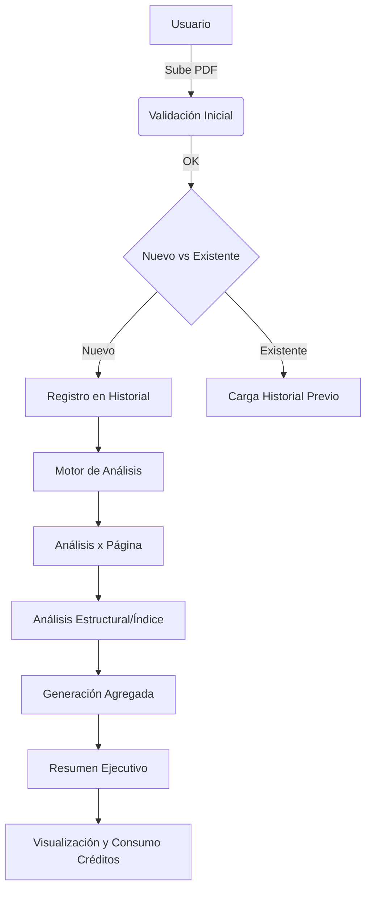

# Flujo Funcional: Analizador de Documentos (AnDo)

**Fecha:** 25 de enero del 2026
**Estado:** Diseño Detallado

Este documento detalla el flujo lógico del sistema AnDo, cubriendo desde la carga del documento hasta la generación de entregables, integrando el modelo conceptual SaaS.

## 1. Diagrama de Alto Nivel


## 2. Detalle de Procesos

### 2.1 Módulo de Carga e Ingreso
*   **Entrada:** Archivo BINARIO (PDF).
*   **Validaciones:**
    *   Formato MIME: `application/pdf`.
    *   Tamaño máximo: (Definir límite, ej. 20MB para prototipo).
    *   Integridad: El archivo no debe estar corrupto.
*   **Acción:**
    *   Calcular hash (SHA-256) del archivo para identificación única.
    *   Consultar base de datos/log local de historiales usando el hash.
    *   Si es nuevo: Iniciar flujo de análisis completo.
    *   Si existe: Mostrar opción de "Ver historial" o "Re-analizar (Revisión)".

### 2.2 Motor de Análisis (Core)

#### A. Iteración de Páginas (Page-by-Page)
Para cada página `i` de `1` a `N`:
1.  **Extracción de Texto:** Obtener capa de texto raw.
2.  **Detección de Imágenes:**
    *   Escanear objetos gráficos incrustados.
    *   Filtrar por tamaño mínimo (para evitar iconos/líneas decorativas).
    *   **Procesamiento IA:** Enviar imagen a modelo (o mock) para obtener "Descripción textual".
3.  **Construcción de Tarjeta de Página (`PageCard`):**
    ```json
    {
      "page_number": 1,
      "text_content": "...",
      "images": ["descripción img 1", "descripción img 2"],
      "token_count": 150
    }
    ```

#### B. Análisis Estructural (Indexing)
1.  **Extracción de TOC (Table of Contents):** Leer metadatos del PDF o inferir estructura por tamaño de letra/negritas si no existe TOC interno.
2.  **Validación de Congruencia (Cross-Check):**
    *   *Input:* Título del apartado vs. Texto extraído de las páginas correspondientes.
    *   *IA Task:* "¿El contenido de las páginas X-Y corresponde realmente al tema 'Título Z'?".
    *   *Output:* Score de congruencia (0-100%) y observación.

### 2.3 Generación de Resultados

#### A. Resumen Ejecutivo
*   **Input:** Colección completa de `PageCards` + `IndexCard`.
*   **IA Task:** Generar síntesis de: Naturaleza, Temas Clave, Hallazgos y Alertas.
*   **Output:** Texto formato Markdown para visualización.

#### B. Registro de Historial
*   Guardar registro JSON con:
    *   Timestamp: `YYYY-MM-DD HH:MM` (24h).
    *   Hash del archivo.
    *   Conteo de páginas.
    *   Versión del análisis (V1.0, V1.1...).

## 3. Modelo SaaS (Lógica de Créditos)
*Este modelo es conceptual para el prototipo.*

| Acción | Costo (Créditos) |
| :--- | :--- |
| Carga y Análisis Texto Base | 1 por página |
| Análisis de Imagen (IA Vision) | 5 por imagen |
| Validación de Índice (IA Logic) | 10 por documento |
| Comparación de Versiones | 20 por revisión |

*   **Implementación:** El sistema calculará el "Costo Total Estimado" antes de confirmar la ejecución (simulado).

## 4. Estructura de Datos (Output JSON Preliminar)
```json
{
  "document_id": "sha256_hash",
  "metadata": {
    "filename": "doc.pdf",
    "upload_date": "25 de enero del 2026",
    "total_pages": 15
  },
  "analysis": {
    "pages": [ ... ],
    "index_validation": { ... },
    "executive_summary": "..."
  },
  "usage": {
    "credits_consumed": 45
  }
}
```
